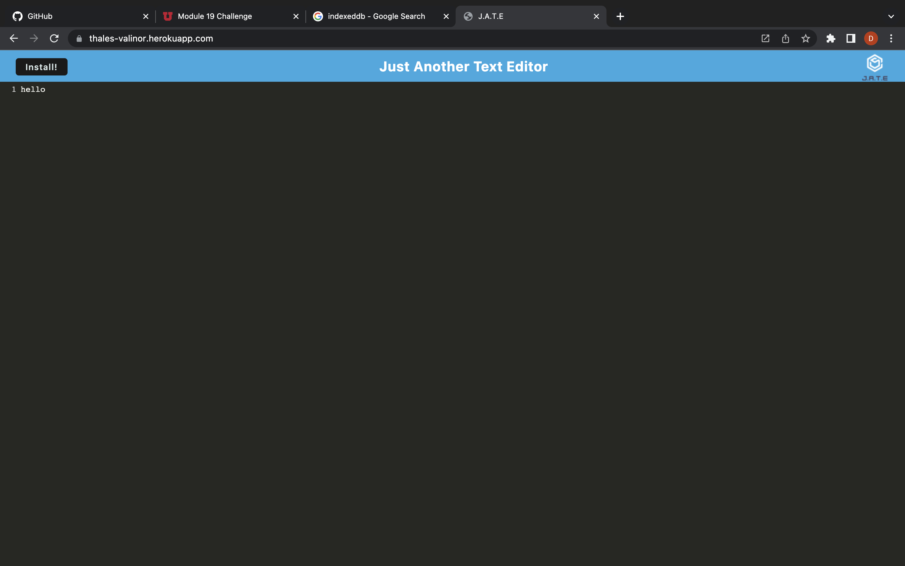

# Just Another Text Editor

This is a crack at a progressive web application. A text editor and code-snippet-shower
that saves, whenever the tab loses focus, what the user has typed. It can be saved to 
the desktop and functions offline. It is bundled with webpack, and caching is handled 
by a service worker. IndexedDB, a clientside noSQL solution, stores entries in a simple 
key-value format.  

[Heroku Deployment](https://thales-valinor.herokuapp.com/)

